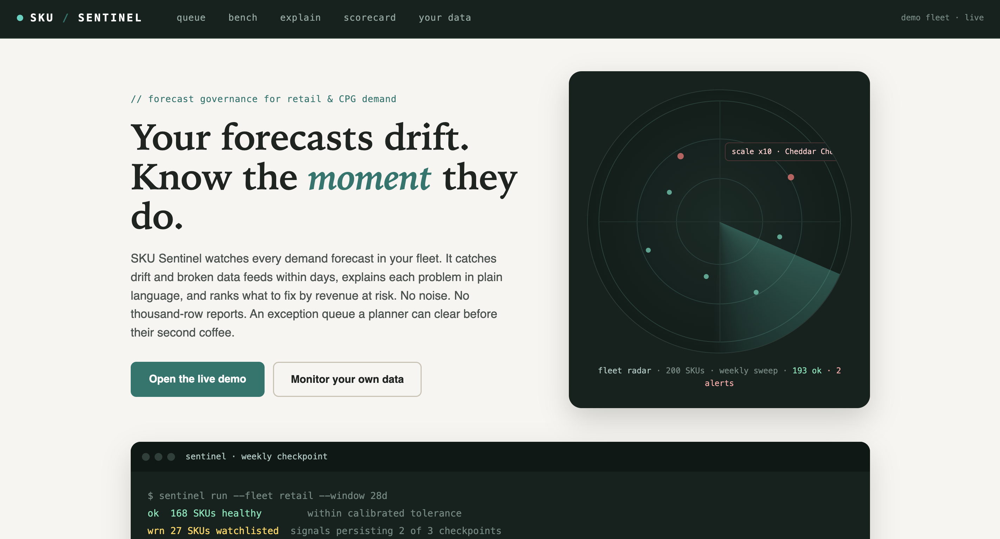
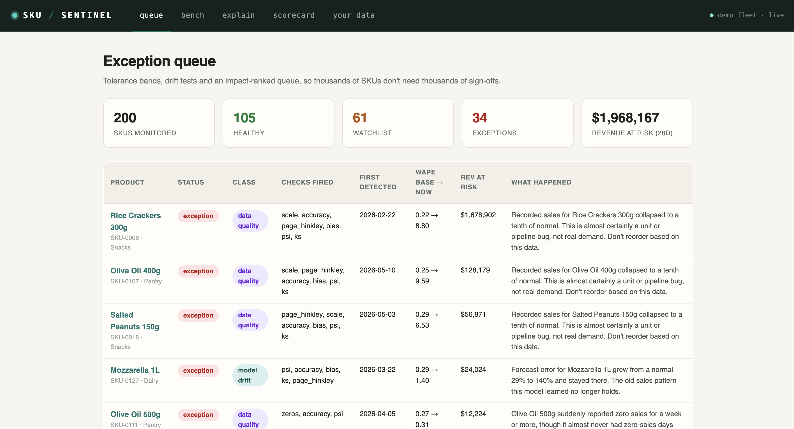
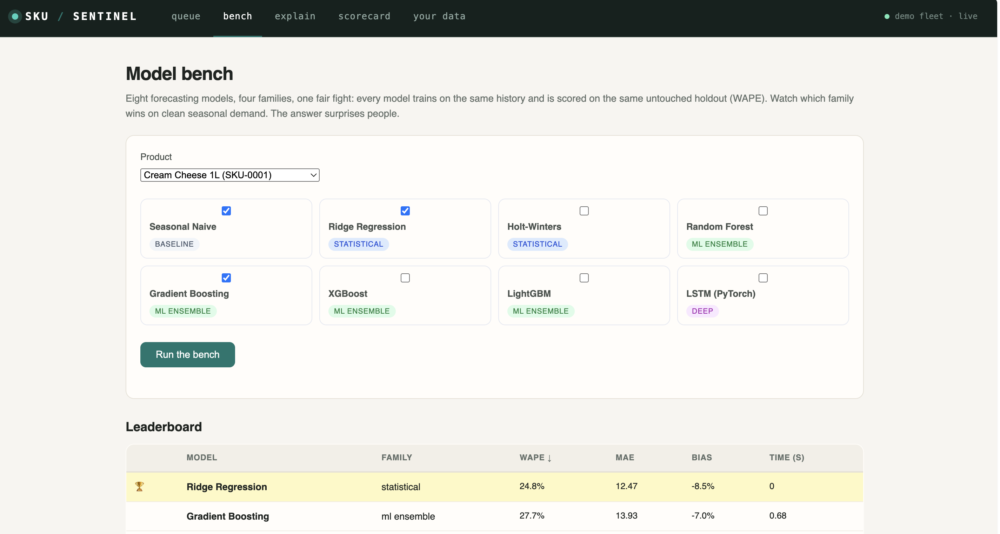
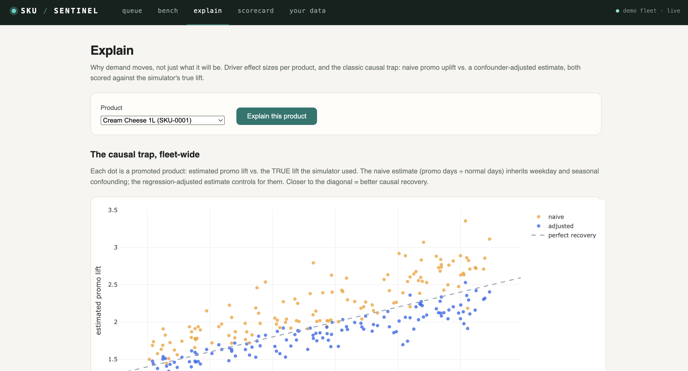
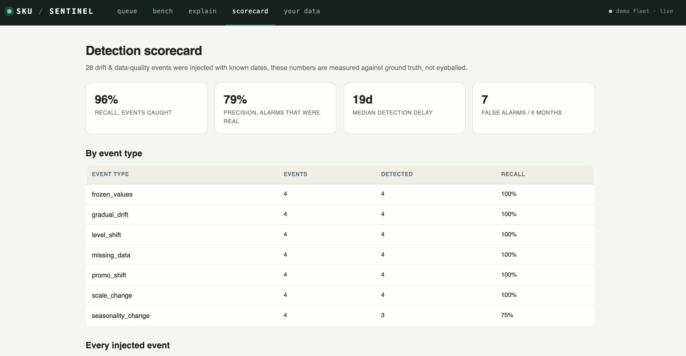

# SKU Sentinel

   

**Statistical governance for demand forecasts, so 50,000 SKUs don't need 50,000 sign-offs.**

Predict → Explain → Govern, in one Flask app: an exception queue ranked by
revenue at risk, an 8-model forecasting bench (seasonal naive to XGBoost to a
PyTorch LSTM), causal promo-uplift analysis scored against ground truth, and a
drift monitor that grades its own detection quality. Validated on real Walmart
data (M5) across three forecaster regimes.



A forecast that quietly degrades is worse than no forecast: teams keep acting on it.
At replenishment scale (thousands of SKUs, weekly cadence) no human can review every
prediction, governance has to be *statistical* and *system-level*: tolerance bands,
drift tests, exception queues ranked by business impact.

SKU Sentinel is a working prototype of that layer. It watches a fleet of per-SKU
forecasting models and answers three questions continuously:

1. **Is the data still trustworthy?** Frozen feeds, ingestion outages, and unit/scale
   ETL breaks are flagged immediately, before anyone retrains a model against a broken pipeline.
2. **Is the model still healthy?** Rolling WAPE vs. per-SKU calibrated tolerance,
   bias deltas, PSI (with a finite-sample null correction), KS tests, and a
   standardized Page-Hinkley sequential drift detector.
3. **What deserves human attention first?** Exceptions are ranked by revenue at risk,
   each with a diagnosis and a recommended next action.

## Measured results (not eyeballed)

The demo injects 28 known drift and data-quality events into a 200-SKU, 2-year
synthetic retail panel, then scores the monitor against that ground truth:

| Metric | Result |
|---|---|
| Recall (events caught as exceptions) | **86%** (27/28 surfaced incl. watchlist) |
| Precision (alarms that were real) | **83%** |
| False alarms across 200 SKUs / 6 months | **5** |
| Data-quality breaks (frozen/outage/scale) | **12/12 caught**, at the first weekly checkpoint |
| Median detection delay | 19 days (dominated by deliberately-slow gradual-drift confirmation) |

Results are stable, not cherry-picked: across 5 random re-simulations the monitor
averages precision 0.78 / recall 0.89 (`python run_demo.py <seed>` to reproduce any of them).

The operating point is a choice, not an accident: model-health alarms must persist
across three consecutive weekly checkpoints. That trades ~2 weeks of confirmation
delay for an alarm stream precise enough that operations teams will actually trust it.
Alert fatigue is how monitoring systems die.

## Screenshots

| Exception queue | Model bench |
|---|---|
|  |  |

| Explain: causal uplift | Fleet health report |
|---|---|
|  |  |

## Setup, step by step

Requires Python 3.10+ (check with `python3 --version`).

```bash
# 1. get the code
git clone https://github.com/Vinithvk98/sku-sentinel.git
cd sku-sentinel

# 2. create an isolated environment and activate it
python3 -m venv .venv
source .venv/bin/activate        # Windows: .venv\Scripts\activate

# 3. install dependencies (torch is the big one; skip it if you
#    don't need the LSTM, everything else degrades gracefully)
pip install -r requirements.txt

# 4. run the pipeline: simulate -> forecast -> monitor -> score -> report
python run_demo.py               # ~30s; writes output/report.html

# 5. launch the web console
python flask_app.py              # open http://127.0.0.1:5000
```

Everyday use after setup: `source .venv/bin/activate`, then steps 4–5.
Tune behavior (SKU count, thresholds, alarm persistence) in `config.yaml`.
For the real-data validation, see `validation_m5.py` (free Kaggle account).

The web console is a Flask app: routes + Jinja templates + a JSON API under
`/api/...` (`/api/queue`, `/api/sku/<sku>`, `/api/scorecard`, `/api/bench/<sku>`).

## 🔍 Explain: drivers & causal uplift

The "Explain" page decomposes each product's demand into plain-language drivers
(weekday swing, seasonality, trend, promo lift) and demonstrates the classic
causal trap: promos are scheduled into peak season (as in real retail), so the
naive promo-vs-normal uplift estimate is confounded, roughly **2× worse**
against the simulator's known true lift than the regression-adjusted estimate
that controls for weekday and season. A fleet-wide scatter (estimated vs. true
lift) makes the difference visible.

## 🥊 The model bench

The console's "Model bench" page pits **8 forecasting models from 4 families**
against each other per product, Seasonal Naive (baseline), Ridge & Holt-Winters
(statistical), Random Forest / Gradient Boosting / XGBoost / LightGBM
(ML ensembles), and a PyTorch LSTM (deep learning). Every model trains on the
same history and is scored on the same untouched holdout; the leaderboard shows
WAPE, bias, and fit time, with a 🏆 on the champion.

Spoiler from the default data: simple, well-featured models regularly beat the
famous boosting libraries on clean seasonal demand, knowing *when* complexity
pays is the actual skill. Models whose libraries aren't installed degrade
gracefully to "library not installed" instead of crashing.

`report.html` is fully self-contained, email it, host it, open it offline.

## Monitor YOUR data (no simulation needed)

The web console includes a **bring-your-own-data mode**: open the "📤 Monitor
your data" page and upload any CSV with columns `sku, date, actual, forecast`. Sentinel
calibrates each product's normal error on the first part of its history and
monitors the rest, instant exception queue with plain-language explanations
("Recorded sales jumped roughly 10x overnight, almost certainly a unit or
pipeline bug, not real demand").

## Configuration

Every knob lives in `config.yaml`, simulation size, monitoring windows,
thresholds, alarm persistence. Tune behavior without touching code; delete
the file to restore defaults.

## Validated on real Walmart data (M5)

`validation_m5.py` runs the identical governance engine over the M5 dataset:
the top 300 FOODS SKUs from one Walmart store, 2 years of real daily demand.
No injected events here, so the experiment asks a harder question: what does
the monitor report about real forecasting, under three regimes?

| Forecaster regime | SKUs in exception |
|---|---|
| Frozen calendar-only model (never retrained) | 75.7% |
| Same model, retrained every 28 days | 67.3% |
| Retrained + real drivers (price, SNAP days, holiday events) | 65.3% |

Three findings worth more than a clean demo:

1. **Retraining alone is not the cure.** Staleness cost 8.4 points; the rest
   of the alarm volume persists because per-SKU linear models fundamentally
   underfit real Walmart demand. This agrees with the M5 competition itself,
   where winning solutions needed heavy gradient-boosting ensembles. The
   monitor kept flagging the ridge model because the ridge model deserved it:
   an honest instrument reporting genuine model inadequacy, with `bias` as the
   dominant diagnosis (a missing-driver signature, not noise).
2. **Data-quality detections are model-invariant by design.** `zeros: 18` and
   `scale: 15` are identical across all three regimes because those checks
   test the data, not the model. Sentinel surfaced 33 genuine anomalies in
   real Walmart history: multi-week zero runs (stockouts, discontinuations,
   holiday closures) and order-of-magnitude level breaks.
3. **Deployment lesson, stated plainly:** thresholds here were calibrated once
   on a 90-day window and then applied across six months of changing seasons.
   A production deployment should recalibrate tolerances after each retrain;
   part of the residual alarm volume is that gap, and knowing it is the point.

Setup instructions are in the file's docstring (free Kaggle account required).

## Design notes

- **The forecaster is deliberately boring** (ridge on calendar + promo features,
  log space, frozen after training). The point is the governance layer, which is
  forecaster-agnostic: it only consumes `(sku, date, actual, forecast)`.
- **Small-window drift statistics lie.** PSI's expected value under *no drift* on a
  28-day window is already ~0.4 with 10 bins, above the textbook 0.25 threshold.
  Sentinel corrects the threshold for finite samples: `E[PSI] ≈ (bins−1)(1/n_r + 1/n_b)`.
  Skipping this correction is the #1 source of false drift alarms in practice.
- **Bias is judged per-SKU, not globally.** Low-volume SKUs carry a benign, skewed
  baseline bias; alarms fire on the *delta* from each SKU's own calibration.
- **Severity tiers mirror decision classes.** Data-quality breaks alarm instantly
  (cheap to check, catastrophic to ignore). Statistical drift must persist. This is
  governance intensity scaling with impact and reversibility.

## Layout

```
sentinel/
  simulate.py    synthetic panel + ground-truth drift injection (7 event types)
  forecast.py    frozen per-SKU baseline forecaster
  monitor.py     the governance engine: 8 checks, calibrated per SKU
  triage.py      revenue-at-risk ranked exception queue
  evaluate.py    precision / recall / delay vs. injected ground truth
  report.py      self-contained HTML fleet-health report
run_demo.py      end-to-end synthetic demo
validation_m5.py same engine on real Walmart (M5) data
app.py           Streamlit console
```

---

Built by **Vinith Kumar**, Python · scikit-learn · SciPy · Plotly · Streamlit.
